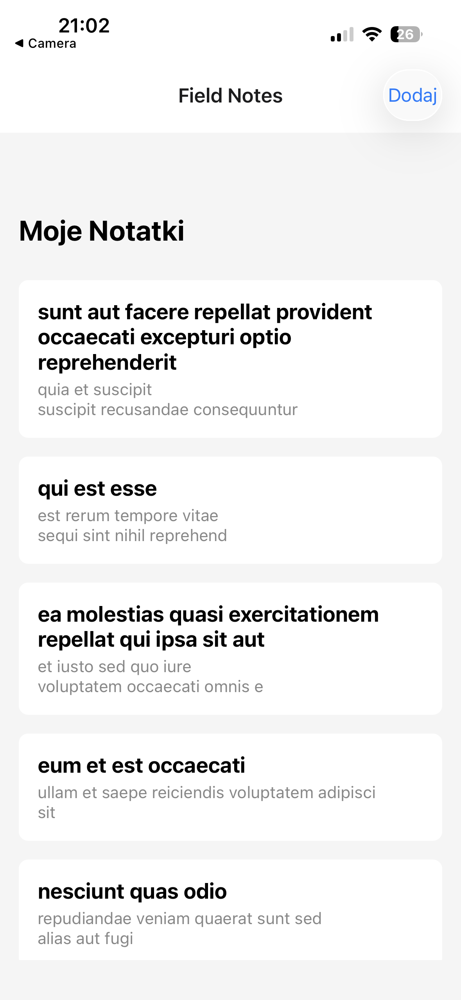
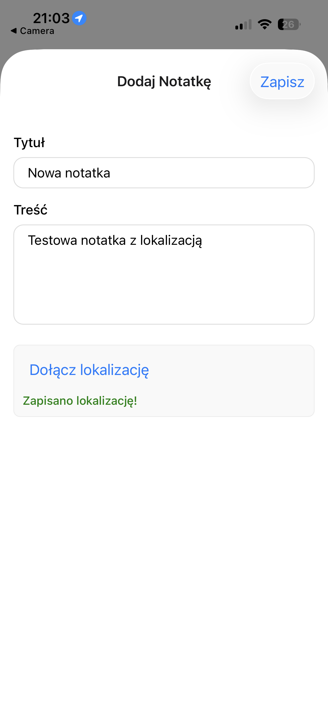
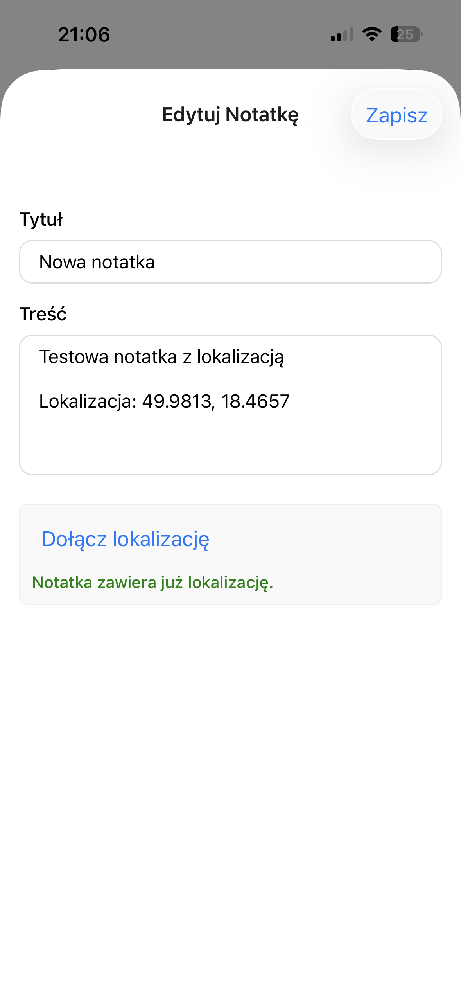
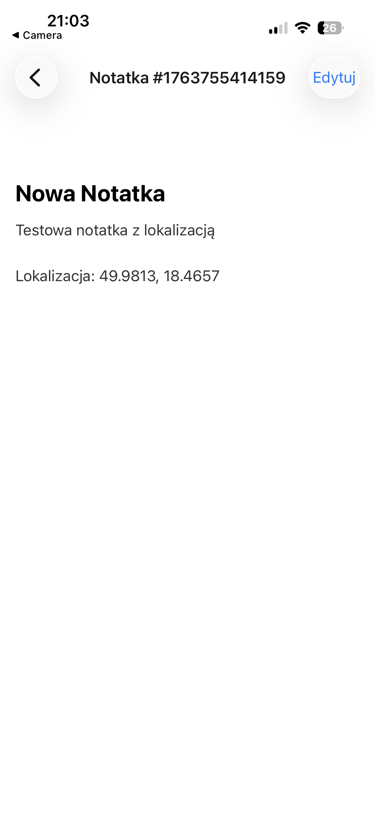

# React Native - Field Notes

Podstawowa aplikacja mobilna "Field Notes" stworzona w React Native przy użyciu Expo wykorzystująca natywną funkcję urządzenia oraz komunikuje się z API.

## Spełnione wymagania funkcjonalności

Aplikacja implementuje wszystkie kluczowe wymagania:

* **Implementacja Widoków (3):**
    1.  **Lista Notatek (`app/index.tsx`):** Główny ekran wyświetlający listę wszystkich notatek.
    2.  **Szczegóły Notatki (`app/note/[id].tsx`):** Ekran dynamiczny, który pokazuje szczegółową treść i tytuł wybranej notatki.
    3.  **Formularz Dodaj/Edytuj (`app/add-note.tsx`):** Jeden formularz, który obsługuje dwie funkcje: tworzenie nowego wpisu (jeśli wejdzie się z ekranu głównego aplikacji) oraz edytowanie istniejącej notatki (jeśli wejdzie się z ekranu szczegółów).

* **Integracja z API (Odczyt)**
    Przy pierwszym uruchomieniu aplikacja pobiera listę 10 przykładowych notatek z publicznego API `jsonplaceholder.typicode.com/posts`.

* **Zarządzanie Stanem (Prosty Store)**
    Stan aplikacji (lista notatek oraz logika ich modyfikacji) jest zarządzany globalnie przy użyciu **React Context API** (`context/notes-context.tsx`). Kontekst przechowuje pobraną listę i udostępnia funkcje `addNote` oraz `editNote`, co pozwala na natychmiastową aktualizację interfejsu po dokonaniu zmiany.

* **Funkcja Natywna** - moduł **`expo-location`**. 
    
   1.  **Uzasadnienie wyboru:** Wybrana funkcja natywna (lokalizacja GPS), idealnie pasuje do motywu aplikacji "Field Notes". Pobieranie lokalizacji to kluczowa funkcja dla "Notatek Terenowych" i jest wprost sugerowana w nazwie aplikacji.
   
   2.  **Implementacja:** Aplikacja pozwala użytkownikowi na pobranie aktualnej lokalizacji (za zgodą) podczas tworzenia lub edytowania notatki. Po kliknięciu 'Pobierz Lokalizację' pobierane są współrzędne i są one dołączane do treści notatki na samym dole. Konfiguracja uprawnień iOS znajduje się w `app.json`.

## Uruchamianie Projektu

Projekt został stworzony w trybie "Managed Workflow" i jest przeznaczony do uruchamiania w aplikacji mobilnej **Expo Go** na urządzenia iOS.

1.  Sklonuj repozytorium.
2.  W głównym folderze aplikacji przejdź do folderu `czysty-projekt` 
    ```bash
    cd czysty-projekt
    ```
3.  Zainstaluj zależności:
    ```bash
    npm i
    ```
4.  Uruchom serwer deweloperski Expo:
    ```bash
    npx expo start
    ```
5.  Zeskanuj wygenerowany kod QR za pomocą aplikacji Expo Go na swoim urządzeniu mobilnym (iOS).

## Galeria








